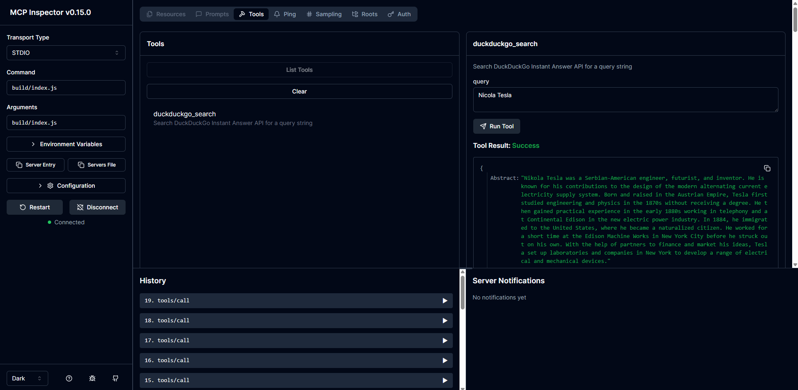

# MCP DuckDuckGo Search

A Model Context Protocol (MCP) server querying DuckDuckGo Instant Answer API.

## Installation

### Manual Installation
```bash
# Clone the repository
git clone https://github.com/shaheen2013/duckduckgo-search-mcp-server.git
cd duckduckgo-search-mcp-server

# Install dependencies
npm install

# Build the project
npm run build
```

## Usage

### Running the Server

You can use the MCP Inspector to test the server:

```bash
npm run inspector
```

Access the MCP Inspector and then test the tool e.g.




## Development

### Project Structure

- `src/index.ts` - Main server implementation

### Available Scripts

- `npm run build` - Build the TypeScript code
- `npm run watch` - Watch for changes and rebuild
- `npm run inspector` - Run the MCP Inspector against the server


## Contributing

Contributions are welcome! Please feel free to submit a Pull Request.

## Acknowledgments

- [Open Library API](https://openlibrary.org/developers/api)
- [Model Context Protocol](https://github.com/modelcontextprotocol)
